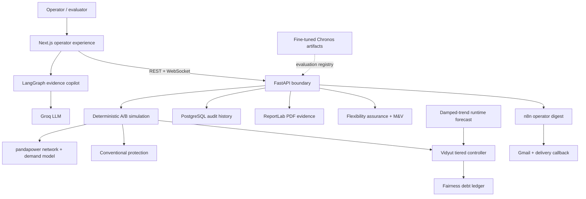

# Vidyut

> Forecast stress early. Coordinate the smallest fair response. Keep critical services powered.

Vidyut is an auditable distribution-network intelligence platform for overloaded urban localities. It runs the same demand through two deterministic worlds—conventional transformer protection and the Vidyut controller—then lets an operator replay, inspect, question, and export every outcome.

It combines a pandapower digital twin, a tiered demand-response controller, a persistent household fairness ledger, a fine-tuned Chronos-Bolt forecasting study on real Indian smart-meter data, an evidence-grounded LangGraph copilot, post-event measurement and verification, and an n8n operator-notification workflow.

**Vidyut is a simulation and decision-support prototype. It is not connected to live utility equipment and cannot issue field commands.**


## The 30-second evaluator summary

| Question | Vidyut's answer |
| --- | --- |
| What fails today? | When a distribution transformer overloads, conventional protection can disconnect an entire locality—including critical loads. |
| What does Vidyut change? | It forecasts local stress, shifts deferrable demand, reconfigures topology, controls enrolled devices, applies meter limits, and disconnects only as a last resort. |
| How is the comparison fair? | Baseline and Vidyut receive the same generated population, demand, weather, topology, parameters, and random seed. Only the control strategy changes. |
| Where is the ML? | Chronos-Bolt-small was fine-tuned for day-ahead forecasting and evaluated on held-out real CEEW smart-meter data from Mathura and Bareilly. |
| Is the ML result real? | Yes. The training code, fitted predictor archive, forecasts, and detailed evaluation JSON are shipped in `backend/ml/`. |
| Is Chronos driving the live simulation? | No. The real-time loop currently uses the lightweight `damped_trend` forecaster; `/api/models` reports Chronos as trained but evaluation-only. |
| What makes it auditable? | Every run retains inputs, per-tick states, controller events, reason codes, household burden, notifications, delivery state, and a generated PDF report. |

## Measured results

### 1. End-to-end heatwave response

The repository includes a deterministic 24-hour, 96-interval heatwave replay across **60 distribution transformers and 4,200 simulated homes**. These figures are read directly from [`backend/data/recorded/heatwave-42.json`](backend/data/recorded/heatwave-42.json):

| Outcome | Conventional protection | Vidyut | Change |
| --- | ---: | ---: | ---: |
| Peak homes dark | 980 | **49** | **95.0% fewer** |
| Homes-dark minutes | 107,100 | **3,780** | **96.5% lower** |
| Unserved energy | 4,086.84 kWh | **1.40 kWh** | **99.97% lower** |
| Critical-load uptime | 97.85% | **100.00%** | **+2.15 points** |
| Maximum household burden | 540 min | **300 min** | **240 min lower** |
| Non-converged power-flow ticks | 0 | **0** | Stable in both arms |

The recorded stress case is intentionally severe: maximum loading remains above the equipment limit even after Vidyut exhausts available flexibility. The result demonstrates graceful degradation—not a claim that software can create capacity that does not exist.

### 2. Fine-tuned Chronos-Bolt forecasting

Vidyut fine-tunes **Chronos-Bolt-small** for a 96-step day-ahead horizon at 15-minute resolution. The training pipeline uses real CEEW high-frequency smart-meter measurements from **Mathura and Bareilly, Uttar Pradesh**, resampled downward to 15 minutes without synthetic training data.

The held-out evaluation covers **1,285,204 training observations across 192 evaluation series** spanning transformer aggregates, household clusters, and individual homes. Lower MASE is better; a value below `1.0` beats the in-sample seasonal-naive scale.

| Forecast model | Day-ahead MASE | Day-ahead MAPE | Result |
| --- | ---: | ---: | --- |
| Seasonal naive | 1.0635 | 60.56% | Operational baseline |
| Chronos-Bolt zero-shot | 0.8748 | 45.79% | 17.7% better MASE than seasonal naive |
| **Chronos-Bolt fine-tuned** | **0.8579** | **43.23%** | **19.3% better MASE than seasonal naive** |

Additional evidence:

- **Next-hour MASE:** `0.3779` versus `0.6958` for seasonal naive—a **45.7% improvement**.
- **14-day cold start:** fine-tuned Chronos `0.8238` versus a from-scratch tabular model `0.9322`—an **11.6% improvement**.
- **Fine-tuning gain:** `0.8579` versus zero-shot `0.8748`—a further **1.9% improvement**.
- **Configuration:** 2,000 fine-tuning steps, learning rate `1e-5`, seed `42`, 96-step horizon.

Reproducible evidence:

- [Training script](backend/ml/kaggle_training/train_forecast.py)
- [Training notebook](backend/ml/kaggle_training/train_forecast.ipynb)
- [Detailed evaluation](backend/ml/models/forecast_eval.json)
- [Fine-tuned forecast output](backend/ml/models/forecasts.parquet)
- `backend/ml/models/forecast_predictor.zip` — fitted AutoGluon/Chronos predictor archive

#### Runtime boundary

| Capability | Status |
| --- | --- |
| Chronos training and held-out evaluation | ✅ Complete |
| Fitted predictor and forecasts shipped | ✅ Complete |
| Metrics exposed through `GET /api/models` | ✅ Complete |
| Chronos inference inside every simulation tick | **Not enabled** |
| Live simulation forecaster | `damped_trend` |

This separation is deliberate and visible in the API. The tick loop stays deterministic and dependency-light, while the model registry presents the real-data forecasting evidence without claiming that a 188 MB AutoGluon predictor is running when it is not.

Read the full ML methodology in [backend/ml/README.md](backend/ml/README.md).

## Why this problem matters

Indian distribution networks are absorbing growing cooling and EV demand while smart-meter coverage and historical telemetry are still developing. A feeder-level average can look safe while one neighborhood transformer is already close to its thermal limit. Conventional protection sees the violation late and responds coarsely: trip the transformer, darken every connected home, and restore it later.

Vidyut changes the control objective from “disconnect enough load” to:

1. predict which transformer will breach its safe limit;
2. calculate the local shortfall;
3. use the least disruptive available flexibility;
4. exclude critical households from controllable actions;
5. rotate unavoidable burden using persistent fairness debt; and
6. retain enough evidence to explain and verify the decision.

## How Vidyut responds

The controller evaluates the network every 15 simulated minutes and escalates only as far as required:

| Stage | Response | Purpose |
| --- | --- | --- |
| Observe | AMI coverage, transformer loading, weather stress, registered devices | Build a local view of demand and available flexibility |
| Forecast | Four-interval transformer outlook in the live loop | Detect risk before protection trips |
| Tier 0 | Time-of-day price signal | Ask non-critical homes without connected control to shift voluntarily |
| Tier 1 | Defer flexible runs and evaluate tie-switch reconfiguration | Remove stress with minimal customer impact |
| Tier 2 | Curtail enrolled devices, then apply temporary smart-meter load limits | Clear the forecast shortfall locally |
| Tier 3 | Debt-weighted rotational disconnection | Last resort after flexibility is exhausted |
| Verify | Compare baseline, observed demand, delivered reduction, and fairness outcomes | Produce an auditable result |

Critical-tier households are excluded from device curtailment, load limiting, and rotation. The controller has no dependency on n8n, LangGraph, or the frontend; the core simulation remains deterministic and headless.

## System architecture



### Architectural safety boundaries

- `services/sim` does not import `services/persistence`; database failure cannot change simulation logic.
- The LangGraph copilot receives curated evidence and has **no actuation tool**.
- The flexibility-assurance engine estimates aggregate opportunity and explicitly **does not identify appliances**.
- Operator email is accepted only with consent, rate-limited, sent once, and not stored in the Vidyut run record.
- The baseline and Vidyut arms share the same demand realization, enabling a defensible counterfactual.

## Product experience

| Surface | What an evaluator can do |
| --- | --- |
| Landing story | Understand the heatwave → overload → targeted response narrative without reading a technical report |
| Command center | Inspect network loading, transformer state, interventions, evidence, and the 3D digital twin |
| Replay | Play, pause, accelerate, or scrub all 96 intervals while every panel stays synchronized |
| Simulation Lab | Generate a fresh deterministic baseline-versus-Vidyut run with custom assumptions |
| Assurance & Models | Inspect the Chronos evaluation, flexibility boundaries, and post-event M&V methods |
| Vidyut Copilot | Ask risk, comparison, resident-impact, and incident questions grounded in the selected frame |
| Audit export | Open a structured PDF report containing run identity, outcomes, and controller events |
| Operator automation | Send a real simulated-run digest to the evaluator acting as the control-room operator |

### The Copilot is agentic where it is useful

The server-side LangGraph workflow:

1. validates and grounds the selected simulation context;
2. classifies the question;
3. routes it to a risk, comparison, resident, incident, or general specialist;
4. drafts an answer from an allow-listed evidence set;
5. verifies numeric claims;
6. repairs unsupported claims; and
7. returns the answer with its visible audit path.

It explains decisions; it cannot operate equipment.

## Privacy-aware flexibility assurance

Vidyut does not pretend that unreliable appliance-level NILM results are operational truth. The observability layer instead distinguishes five quantities:

- **registered:** controllable device nameplate capacity;
- **estimated:** temperature-associated flexible opportunity from aggregate AMI and weather history;
- **actionable:** estimated opportunity capped by the registered envelope;
- **simulated:** flexibility used by the digital twin; and
- **verified:** reduction measured after an event using `high_4_of_5` or `ten_in_ten` baselines.

This is simpler to audit, works with aggregate measurements, and keeps estimation separate from control authority.

## Technology

| Layer | Stack |
| --- | --- |
| Frontend | Next.js 16, React 19, TypeScript, Framer Motion, Recharts, Three.js / React Three Fiber |
| Agentic explanation | LangGraph, LangChain, Groq, Zod evidence validation |
| API | Python 3.11, FastAPI, Pydantic, WebSockets |
| Power-system simulation | pandapower, NumPy, SciPy, NetworkX, Pandas |
| Forecast research | Chronos-Bolt-small, AutoGluon TimeSeries, PyTorch |
| Persistence | PostgreSQL 16, SQLAlchemy 2, Alembic |
| Audit and automation | ReportLab, n8n, Gmail OAuth, authenticated delivery callbacks |
| Deployment | Docker Compose, Azure VM, Caddy TLS, Vercel, Cloudflare DNS |

## Three-minute evaluation path

1. Open the landing page and play **Watch the heatwave response**.
2. Enter the command center and scrub to the evening peak.
3. Switch between baseline and Vidyut in the 3D twin.
4. Open **Simulation Lab**, run the same seed through both arms, and inspect the outcome delta.
5. Open **Assurance & Models** to review the fine-tuned Chronos evidence and runtime boundary.
6. Ask the Copilot: “Why is this transformer at risk?” and expand its audit path.
7. Generate the PDF report or send the one-time simulated operator digest.

The included recorded replays keep steps 1–3 available even if the live API is temporarily unavailable.

## Local quick start

### Prerequisites

- Docker Desktop with Docker Compose
- Node.js 20+
- Python 3.11 and [`uv`](https://docs.astral.sh/uv/) for direct backend development

### Start the API and database

```bash
git clone https://github.com/KrishnaPrakhya/Vidyut-AI.git
cd Vidyut-AI
cp .env.example .env
docker compose up --build
```

The API is available at `http://localhost:8000`; interactive OpenAPI documentation is at `http://localhost:8000/docs`.

### Start the frontend

```bash
cd frontend
npm ci
npm run dev
```

Open `http://localhost:3000`.

`GROQ_API_KEY` is optional and enables the Copilot through the Next.js server route. n8n is also optional for core simulation and replay; configure it only when testing the email workflow.

### Direct backend development

```bash
cd backend
uv sync
uv run uvicorn services.api.main:app --reload --port 8000
```

## Verification

```bash
# Backend tests
cd backend
uv run pytest -q

# Frontend checks
cd ../frontend
npm run lint
npm run build
```

The backend test suite covers API behavior, determinism, safety invariants, reconfiguration, persistence, fairness debt, observability, n8n dispatch, delivery callbacks, and recording integrity.

Before an evaluation, run the repository-level readiness check:

```powershell
backend\.venv\Scripts\python.exe scripts\demo_check.py
```

Use `--core-only` during local development without n8n. See [docs/demo-readiness.md](docs/demo-readiness.md).

## Key API routes

| Method | Route | Purpose |
| --- | --- | --- |
| `GET` | `/api/health` | API, database, scenario, and automation readiness |
| `POST` | `/api/runs` | Create a deterministic A/B simulation |
| `GET` | `/api/runs/{id}/summary` | Baseline, Vidyut, and delta metrics |
| `GET` | `/api/runs/{id}/events` | Filtered, paginated controller evidence |
| `WS` | `/ws/runs/{id}` | Replay stored ticks at a chosen speed |
| `GET` | `/api/runs/{id}/report` | Generate the audit PDF |
| `GET` | `/api/models` | Chronos evaluation and runtime status |
| `POST` | `/api/observability/flexibility/estimate` | Aggregate weather-associated opportunity |
| `POST` | `/api/observability/events/verify` | Post-event M&V |
| `POST` | `/api/runs/{id}/notifications/dispatch` | Consent-gated n8n operator digest |
| `GET` | `/api/fairness/leaderboard` | Persistent household burden ordering |

The full machine-readable schema is in [docs/api-samples/openapi.json](docs/api-samples/openapi.json), with a plain-language handoff in [frontend/docs/endpoint-guide.md](frontend/docs/endpoint-guide.md).

## Deployment

The production layout uses:

- **Vercel** for the Next.js frontend and server-side Copilot route;
- **Azure Ubuntu VM** for FastAPI, PostgreSQL, n8n, and Caddy;
- **Caddy** for automatic HTTPS and reverse proxying; and
- **Cloudflare** for DNS only.

Only ports `80` and `443` are public. FastAPI, n8n, and PostgreSQL communicate over private Docker networks; SSH should be restricted to the operator's IP.

Follow [docs/deployment-vercel-azure.md](docs/deployment-vercel-azure.md) for the complete portal, DNS, OAuth, rollback, and cost-control procedure.

## Repository map

```text
Vidyut-AI/
├── frontend/                       Next.js operator experience and LangGraph copilot
├── backend/
│   ├── services/api/               FastAPI, WebSocket, report and model registry
│   ├── services/sim/               Deterministic network and controller simulation
│   ├── services/observability/     Flexibility opportunity and post-event M&V
│   ├── services/persistence/       PostgreSQL audit and fairness history
│   ├── services/dispatch/          n8n delivery, retries and rate limits
│   ├── services/forecast/          Lightweight runtime forecaster
│   ├── ml/kaggle_training/         Chronos training script and notebook
│   ├── ml/models/                  Predictor, forecasts and evaluation artifacts
│   ├── data/scenarios/             Heatwave, EV surge and normal-day inputs
│   ├── data/recorded/              Offline deterministic replays
│   └── tests/                      Backend verification suite
├── automation/n8n/                 Importable operator-digest workflow
├── deploy/azure/                   Production Compose, Caddy and VM scripts
├── docs/                           Contracts, deployment and readiness guides
├── scripts/demo_check.py           End-to-end pre-evaluation check
├── docker-compose.yml              Local API + PostgreSQL
└── Makefile                        Common development commands
```

## Honest scope and limitations

- All network and household outcomes are simulated; no live DISCOM system is contacted.
- The Chronos result is a held-out offline evaluation and is not the live tick forecaster.
- Transformer-scale Chronos reporting currently contains five aggregate series; the README exposes that scope rather than presenting it as a fleet-wide field trial.
- The flexibility estimator identifies weather association, not individual appliances.
- PostgreSQL stores demo-scale audit history, not production-scale telemetry.
- Authentication, multi-tenancy, field-device protocols, and regulatory integration are outside the hackathon scope.
- When flexibility is insufficient, Vidyut may still require targeted rotational disconnection. The objective is minimum, fair, explainable harm—not impossible zero-outage guarantees.

## Documentation

- [Backend guide](backend/README.md)
- [Forecasting and Chronos methodology](backend/ml/README.md)
- [Frontend guide](frontend/README.md)
- [Frontend/API contract](docs/frontend-contract.md)
- [Plain-language endpoint guide](frontend/docs/endpoint-guide.md)
- [Persistence and fairness rationale](docs/persistence-scope.md)
- [n8n operator automation](automation/n8n/README.md)
- [Azure runtime](deploy/azure/README.md)
- [Vercel + Azure deployment runbook](docs/deployment-vercel-azure.md)
- [Demo readiness checklist](docs/demo-readiness.md)

---

Vidyut demonstrates a practical principle: distribution intelligence should intervene before a transformer trips, protect critical demand first, distribute unavoidable burden fairly, and leave behind evidence strong enough to audit.
