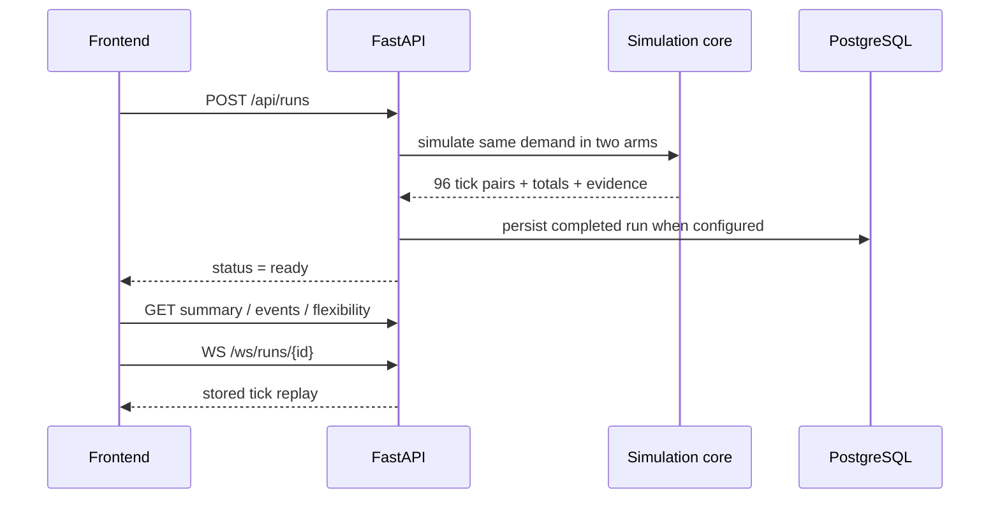

# Vidyut backend

The backend is the auditable execution core of Vidyut. It creates deterministic baseline-versus-Vidyut network simulations, solves every interval with pandapower, records controller evidence, persists fairness history when PostgreSQL is available, generates PDF reports, exposes replay data over WebSockets, and closes the operator-notification loop through n8n.

For the project story and headline results, start with the [root README](../README.md).

## Design goals

- **Comparable:** both control arms receive identical demand, topology, weather, population, and seed.
- **Deterministic:** the same inputs produce the same outputs.
- **Safe by architecture:** the simulation core does not depend on persistence, automation, the frontend, or an LLM.
- **Auditable:** actions include tier, target, kW, household count, reason code, and human-readable detail.
- **Gracefully degradable:** simulation continues in memory when PostgreSQL or n8n is not configured.
- **Honest about models:** the API distinguishes trained evaluation artifacts from the forecaster used at runtime.

## Service map

| Package | Responsibility |
| --- | --- |
| `services/api` | FastAPI routes, WebSocket replay, validation, run lifecycle, reports, model registry |
| `services/sim` | Population, demand, pandapower network, baseline arm, Vidyut arm, metrics, injections |
| `services/sim/controllers` | Conventional transformer protection and the tiered Vidyut controller |
| `services/forecast` | Lightweight `damped_trend` forecaster used in the live simulation loop |
| `services/observability` | Registered flexibility, aggregate weather opportunity, and post-event M&V |
| `services/persistence` | SQLAlchemy models, repository operations, fairness history, delivery state |
| `services/dispatch` | n8n payloads, authenticated dispatch, retries, outbox, and rate limiting |
| `services/actuation` | In-simulation command state and indexed command lookup |
| `ml` | Fine-tuned Chronos-Bolt training pipeline and evaluation artifacts |

## Run lifecycle



Runs are computed first and replayed afterward. WebSocket speed changes playback speed, not simulation physics.

## Controller ladder

The controller begins with the least disruptive option and escalates only when the predicted or measured shortfall remains:

1. price signal for eligible non-critical households;
2. deferrable device shifting;
3. feasible tie-switch reconfiguration;
4. connected-device curtailment;
5. temporary smart-meter load limiting; and
6. debt-weighted rotational disconnection as a last resort.

Critical-tier households are excluded from device control, load limiting, and rotation. Persistent opening debt can be passed into the pure simulation as data without importing the database layer.

## Forecasting status

The live simulation uses `services/forecast/naive.py::DampedTrendForecaster`. The separately trained Chronos-Bolt-small model is evaluated offline and exposed through `GET /api/models` with:

- `trained: true`
- `evaluation_only: true`
- `runtime_ready: false`

This is intentional and testable. Read [ml/README.md](ml/README.md) for the fine-tuning method, real-data evaluation, metrics, and artifacts.

## Local development

Python `3.11` is required.

```bash
cd backend
uv sync
uv run uvicorn services.api.main:app --reload --port 8000
```

Open:

- API health: `http://localhost:8000/api/health`
- OpenAPI UI: `http://localhost:8000/docs`
- Model registry: `http://localhost:8000/api/models`

To start PostgreSQL through the repository Compose file:

```bash
docker compose up postgres -d
```

The root `.env` is canonical. Copy [`.env.example`](../.env.example) to `.env` before testing persistence or n8n.

## Direct deterministic simulation

```bash
cd backend
uv run python -m services.sim.run --scenario heatwave --seed 42
```

Available scenarios are defined in `data/scenarios/`:

- `normal`
- `heatwave`
- `ev_surge`

The API can additionally override AMI penetration, connected-device penetration, EV penetration, critical share, essential share, peak multiplier, and tariff.

## Important API groups

| Group | Routes |
| --- | --- |
| Metadata | `/api/health`, `/api/scenarios`, `/api/models` |
| Replays | `/api/recordings`, `/api/recordings/{scenario}` |
| Runs | `/api/runs`, `/api/runs/{id}`, `/summary`, `/events`, `/flexibility`, `/inject`, `/report` |
| Streaming | `/ws/runs/{id}` |
| Assurance | `/api/observability/status`, `/flexibility/estimate`, `/events/verify` |
| Fairness | `/api/households/{id}`, `/api/fairness/leaderboard` |
| Automation | run notification list, dispatch, delivery summary, and authenticated callbacks |

See the [frontend contract](../docs/frontend-contract.md) and [OpenAPI snapshot](../docs/api-samples/openapi.json) for complete request and response shapes.

## Tests

```bash
cd backend
uv run pytest -q -m "not slow"
uv run pytest -q
```

The suite covers:

- API and WebSocket contracts;
- deterministic replay generation;
- safety and energy-balance invariants;
- topology reconfiguration;
- fairness debt carry-forward;
- PostgreSQL persistence and graceful fallback;
- aggregate flexibility estimation and post-event M&V;
- n8n retries, idempotency, rate limiting, and delivery callbacks; and
- runtime hardening and malformed input.

## Operational behavior

| Dependency | When available | When unavailable |
| --- | --- | --- |
| PostgreSQL | Persists runs, household history, fairness debt, and delivery state | Runs remain available in process memory; database-backed history routes report unavailable |
| n8n | Sends the one-time operator digest and reports delivery | Simulation and reports still work; health exposes `not_configured` |
| Groq | Not used by the backend | No backend effect; the Copilot lives in the Next.js server layer |
| Chronos predictor | Evaluation artifact available in registry | Live controller still uses `damped_trend` |

## Production

The backend production container runs with FastAPI, PostgreSQL, n8n, and Caddy on an Azure Ubuntu VM. Only Caddy exposes public ports. See [deploy/azure/README.md](../deploy/azure/README.md) and the [full deployment runbook](../docs/deployment-vercel-azure.md).
