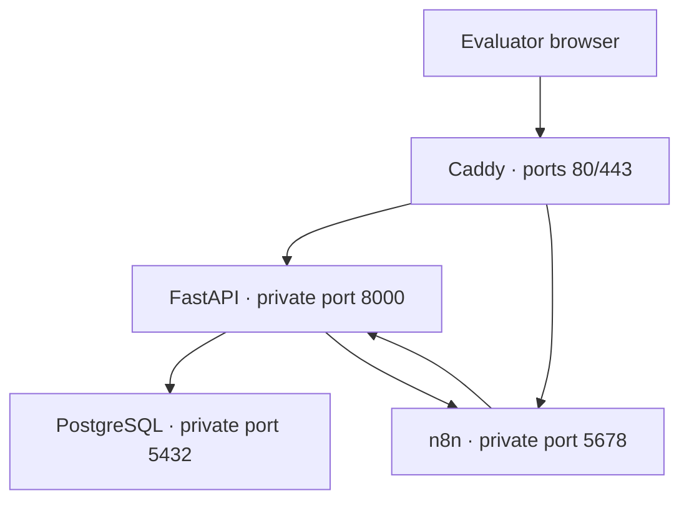

# Vidyut Azure runtime

This directory deploys the stateful Vidyut runtime to one Azure Ubuntu VM while the Next.js frontend remains on Vercel.

## Production topology



Only Caddy publishes ports. PostgreSQL, FastAPI, and n8n communicate over Docker networks. Caddy obtains and renews TLS certificates after the API and n8n DNS records point to the VM.

## Included files

| File | Purpose |
| --- | --- |
| `bootstrap.sh` | Installs Docker and prepares the Ubuntu host |
| `deploy.sh` | Validates configuration, builds the API, and starts the production stack |
| `docker-compose.prod.yml` | PostgreSQL, FastAPI, n8n, and Caddy services with health checks and log rotation |
| `Caddyfile` | HTTPS reverse proxy for the API and n8n domains |
| `env.production.example` | Required non-secret production configuration template |

## Recommended VM

- Ubuntu Server 24.04 LTS Gen2
- `Standard_B2s` — 2 vCPU, 4 GiB RAM
- 32 GiB Standard SSD
- Static public IPv4 address
- TCP 22 restricted to the operator's IP
- TCP 80 and TCP/UDP 443 open publicly
- Ports 5432, 5678, and 8000 closed publicly

## Deploy

```bash
git clone --branch main https://github.com/KrishnaPrakhya/Vidyut-AI.git
cd Vidyut-AI
sudo bash deploy/azure/bootstrap.sh
```

Log out and reconnect after Docker installation, then:

```bash
cp deploy/azure/env.production.example deploy/azure/env.production
nano deploy/azure/env.production
bash deploy/azure/deploy.sh
```

Create two DNS records pointing to the VM before expecting Caddy TLS to succeed:

- `api.example.com` for FastAPI;
- `ops.example.com` for n8n.

Use DNS-only mode during initial certificate issuance. Configure the frontend domain separately in Vercel.

## Verify

```bash
docker compose --env-file deploy/azure/env.production \
  -f deploy/azure/docker-compose.prod.yml ps

curl https://api.example.com/api/health
```

The health response should show a connected database and all operator-automation configuration flags enabled before the judged email demo.

## Update

```bash
git pull --ff-only origin main
bash deploy/azure/deploy.sh
```

Do not regenerate `N8N_ENCRYPTION_KEY` during an update; n8n needs the original key to read stored credentials.

## Full runbook

The complete Azure Portal, Cloudflare DNS, Vercel, n8n, Google OAuth, verification, backup, rollback, and cost-control procedure is in [docs/deployment-vercel-azure.md](../../docs/deployment-vercel-azure.md).
