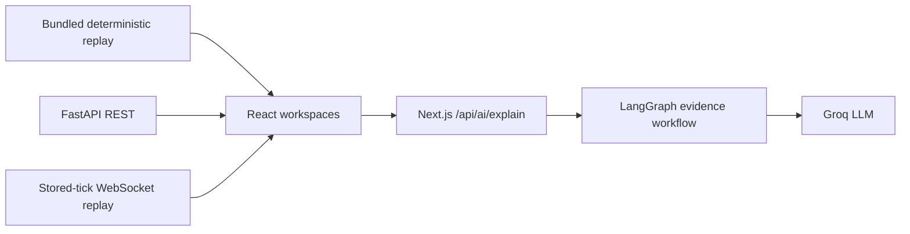

# Vidyut frontend

The Vidyut frontend turns a complex power-system simulation into an operator story: see overload risk before a trip, compare conventional protection with a targeted response, replay every interval, inspect the household impact, and audit the explanation.

It is a Next.js 16 and React 19 application designed for both non-technical evaluators and technical reviewers. Start with the [project README](../README.md) for the measured outcomes and full architecture.

## Workspaces

| Surface | Purpose |
| --- | --- |
| Landing | Scroll-driven explanation of the heatwave, transformer overload, targeted intervention, and avoided blackout |
| Command center | Network-level loading, 3D spatial twin, controller evidence, selected-locality state, and Vidyut Copilot |
| Digital-twin replay | Play, pause, accelerate, or scrub 96 stored intervals while maps, metrics, events, and fairness update together |
| Simulation Lab | Run fresh baseline-versus-Vidyut scenarios, watch progress, inspect results, open the 3D run, and export evidence |
| Assurance & Models | Review flexibility-estimation boundaries, post-event M&V, and the fine-tuned Chronos evaluation |
| Profile and settings | Explain the operator role and system boundaries without introducing fake authentication claims |

The landing page and recorded replays remain useful when the backend is offline. Live simulations, reports, persistence, and automation require the API.

## Fine-tuned Chronos in the UI

The Assurance & Models workspace reads `GET /api/models` and presents the shipped evaluation artifact:

- seasonal-naive day-ahead MASE: `1.0635`;
- Chronos-Bolt zero-shot MASE: `0.8748`;
- **fine-tuned Chronos-Bolt MASE: `0.8579`—19.3% better than seasonal naive**; and
- 14-day cold-start MASE: `0.8238`, 11.6% better than the from-scratch comparison.

The UI also displays `evaluation_only: true` and `runtime_ready: false`. It does not imply that Chronos drives a replay whose tick payload reports `damped_trend`.

See [backend/ml/README.md](../backend/ml/README.md) for data provenance and training methodology.

## Evidence-grounded Vidyut Copilot

Set `GROQ_API_KEY` in the frontend server environment to enable `/api/ai/explain`. The key is used only by the Next.js route handler and must never be prefixed with `NEXT_PUBLIC_`.

The LangGraph workflow:

1. validates the requested run, tick, transformer, and audience;
2. constructs an allow-listed evidence context;
3. routes the request to a risk, comparison, resident, incident, or general specialist;
4. generates a concise operator explanation;
5. checks numeric claims against the supplied evidence;
6. repairs unsupported output; and
7. returns the answer, citations, confidence, and visible graph trace.

The Copilot is advisory. It has no backend command import, device-control tool, or field-actuation permission.

## Local development

Start the backend at `http://localhost:8000`, then:

```bash
cd frontend
npm ci
npm run dev
```

Open `http://localhost:3000`.

For a backend running elsewhere, create `frontend/.env`:

```dotenv
NEXT_PUBLIC_API_URL=http://localhost:8000
NEXT_PUBLIC_SITE_URL=http://localhost:3000
GROQ_API_KEY=
```

`NEXT_PUBLIC_API_URL` and `NEXT_PUBLIC_SITE_URL` are browser-visible by design. `GROQ_API_KEY` is server-only.

## Validation

```bash
npm run lint
npm run build
```

The production build contains a server-rendered Copilot route and statically generated application pages.

## Data flow



Runs are simulated completely before WebSocket playback begins. Scrubbing changes the selected stored frame; it does not rerun the simulation.

## Important implementation rules

- Every operational number comes from a recording, API response, or model artifact.
- Baseline and Vidyut are always shown under identical demand.
- Missing database, automation, model, or evidence state is explicit rather than replaced with placeholder data.
- Technical terms have plain-language explanations for non-grid users.
- Motion respects reduced-motion preferences.
- The resident notification is a labelled preview; the only real recipient is the consenting evaluator acting as operator.
- “Simulated” is communicated at the run/report boundary without being repeated in every Copilot sentence.

## Key files

| Path | Responsibility |
| --- | --- |
| `app/components/landing-page.tsx` | Public narrative and hero digital twin |
| `app/components/command-center.tsx` | Unified operator dashboard |
| `app/components/replay-dashboard.tsx` | Timeline replay and fairness exploration |
| `app/components/simulation-lab.tsx` | Fresh run creation, result handoff, PDF, and operator automation |
| `app/components/assurance-lab.tsx` | Flexibility, M&V, and Chronos model evidence |
| `app/components/network-3d.tsx` | Interactive Three.js distribution network |
| `app/components/ai-explainer.tsx` | Copilot interaction and audit-path UI |
| `app/lib/vidyut-agent.ts` | LangGraph state, routing, verification, repair, and finalization |
| `app/api/ai/explain/route.ts` | Server-side validation and Groq execution boundary |
| `app/lib/replay.ts` | Backend client and replay utilities |
| `app/types.ts` | Shared API and recording types |

## API handoff

- [Machine-oriented frontend context](docs/frontend-context.json)
- [Request and response examples](docs/api-examples.json)
- [Plain-language endpoint guide](docs/endpoint-guide.md)
- [Backend contract](../docs/frontend-contract.md)
- [OpenAPI snapshot](../docs/api-samples/openapi.json)

## Deployment

Vercel builds this directory as the project root. Set:

```dotenv
NEXT_PUBLIC_API_URL=https://api.example.com
NEXT_PUBLIC_SITE_URL=https://app.example.com
GROQ_API_KEY=your-server-only-key
```

See [the Vercel + Azure deployment runbook](../docs/deployment-vercel-azure.md) for CORS, DNS, HTTPS, OAuth, and end-to-end verification.
